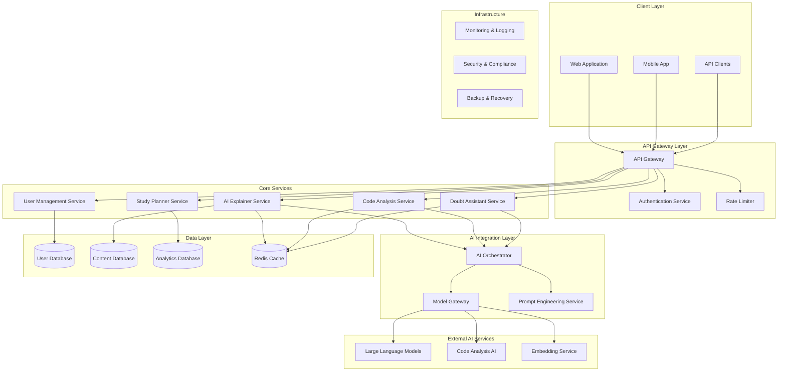

# Design Document: DevSaathi AI - Learning & Developer Productivity Assistant

## Overview

DevSaathi AI is designed as a cloud-native, microservices-based platform that leverages modern AI technologies to provide personalized learning experiences and developer productivity tools. The system follows a modular architecture where AI capabilities are treated as independent, interchangeable building blocks, enabling rapid scaling and feature evolution.

The platform integrates multiple AI services through a unified API gateway, providing seamless user experiences while maintaining separation of concerns between different functional domains. The architecture emphasizes real-time responsiveness, data privacy, and scalable deployment patterns suitable for educational technology requirements.

## Architecture

### System Architecture Overview

The system follows a microservices architecture pattern with the following key components:



### Service Decomposition

**Core Business Services:**
- **AI Explainer Service**: Handles concept explanations, examples, and quiz generation
- **Code Analysis Service**: Processes code understanding, bug detection, and optimization
- **Study Planner Service**: Manages personalized learning paths and progress tracking
- **Doubt Assistant Service**: Provides interactive Q&A and contextual help
- **User Management Service**: Handles authentication, profiles, and user data

**Infrastructure Services:**
- **AI Orchestrator**: Coordinates AI service calls and manages context
- **Model Gateway**: Abstracts external AI service integrations
- **Prompt Engineering Service**: Manages and optimizes AI prompts
- **API Gateway**: Routes requests, handles authentication, and enforces policies

## Components and Interfaces

### AI Explainer Service

**Responsibilities:**
- Process concept explanation requests
- Generate appropriate examples and analogies
- Create interactive quizzes and assessments
- Adapt content complexity based on user skill level

**Key Interfaces:**
```typescript
interface ConceptExplanationRequest {
  concept: string;
  userSkillLevel: SkillLevel;
  preferredStyle: ExplanationStyle;
  includeExamples: boolean;
  generateQuiz: boolean;
}

interface ConceptExplanationResponse {
  explanation: string;
  examples: Example[];
  relatedConcepts: string[];
  quiz?: Quiz;
  estimatedReadingTime: number;
}
```

### Code Analysis Service

**Responsibilities:**
- Parse and analyze submitted code
- Identify bugs, security vulnerabilities, and optimization opportunities
- Generate line-by-line explanations
- Suggest improvements with code examples

**Key Interfaces:**
```typescript
interface CodeAnalysisRequest {
  code: string;
  language: ProgrammingLanguage;
  analysisType: AnalysisType[];
  userExperienceLevel: SkillLevel;
}

interface CodeAnalysisResponse {
  lineByLineExplanation: LineExplanation[];
  detectedIssues: Issue[];
  optimizationSuggestions: Suggestion[];
  patterns: DetectedPattern[];
  complexity: ComplexityMetrics;
}
```

### Study Planner Service

**Responsibilities:**
- Assess user skill levels and learning objectives
- Generate personalized learning paths
- Track progress and adjust recommendations
- Provide milestone tracking and achievement systems

**Key Interfaces:**
```typescript
interface StudyPlanRequest {
  userId: string;
  learningGoals: LearningGoal[];
  availableTimePerWeek: number;
  preferredLearningStyle: LearningStyle;
  currentSkillAssessment: SkillAssessment;
}

interface StudyPlanResponse {
  planId: string;
  learningPath: LearningModule[];
  milestones: Milestone[];
  estimatedCompletionTime: number;
  adaptiveRecommendations: Recommendation[];
}
```

### AI Orchestrator

**Responsibilities:**
- Coordinate multiple AI service calls
- Manage conversation context and memory
- Implement retry logic and fallback strategies
- Optimize AI service usage and costs

**Key Interfaces:**
```typescript
interface AIRequest {
  serviceType: AIServiceType;
  prompt: string;
  context: ConversationContext;
  parameters: AIParameters;
  fallbackStrategy: FallbackStrategy;
}

interface AIResponse {
  result: string;
  confidence: number;
  tokensUsed: number;
  responseTime: number;
  serviceUsed: string;
}
```

## Data Models

### User Domain

```typescript
interface User {
  id: string;
  email: string;
  profile: UserProfile;
  preferences: UserPreferences;
  skillAssessments: SkillAssessment[];
  learningHistory: LearningActivity[];
  createdAt: Date;
  updatedAt: Date;
}

interface UserProfile {
  name: string;
  role: UserRole; // STUDENT, DEVELOPER, ADMIN
  experienceLevel: SkillLevel;
  programmingLanguages: string[];
  learningGoals: string[];
  timezone: string;
}

interface UserPreferences {
  explanationStyle: ExplanationStyle;
  preferredLanguage: string;
  notificationSettings: NotificationSettings;
  privacySettings: PrivacySettings;
}
```

### Learning Domain

```typescript
interface LearningModule {
  id: string;
  title: string;
  description: string;
  concepts: Concept[];
  prerequisites: string[];
  estimatedDuration: number;
  difficulty: DifficultyLevel;
  learningObjectives: string[];
}

interface Concept {
  id: string;
  name: string;
  category: ConceptCategory;
  explanation: string;
  examples: Example[];
  relatedConcepts: string[];
  tags: string[];
}

interface Quiz {
  id: string;
  conceptId: string;
  questions: Question[];
  passingScore: number;
  timeLimit?: number;
}
```

### Code Analysis Domain

```typescript
interface CodeSubmission {
  id: string;
  userId: string;
  code: string;
  language: ProgrammingLanguage;
  analysisResults: AnalysisResult[];
  submittedAt: Date;
}

interface AnalysisResult {
  type: AnalysisType;
  findings: Finding[];
  overallScore: number;
  recommendations: string[];
  processingTime: number;
}

interface Finding {
  severity: Severity;
  category: FindingCategory;
  line: number;
  column: number;
  message: string;
  suggestedFix?: string;
  codeExample?: string;
}
```

### Study Planning Domain

```typescript
interface StudyPlan {
  id: string;
  userId: string;
  goals: LearningGoal[];
  modules: PlannedModule[];
  milestones: Milestone[];
  progress: Progress;
  adaptations: Adaptation[];
  createdAt: Date;
  updatedAt: Date;
}

interface PlannedModule {
  moduleId: string;
  scheduledStartDate: Date;
  estimatedCompletionDate: Date;
  actualCompletionDate?: Date;
  status: ModuleStatus;
  customizations: Customization[];
}

interface Progress {
  overallCompletion: number;
  moduleProgress: ModuleProgress[];
  streakDays: number;
  totalTimeSpent: number;
  achievementsUnlocked: string[];
}
```

Now I need to use the prework tool to analyze the acceptance criteria before writing the Correctness Properties section:

<function_calls>
<invoke name="prework">
<parameter name="featureName">devsaathi-ai